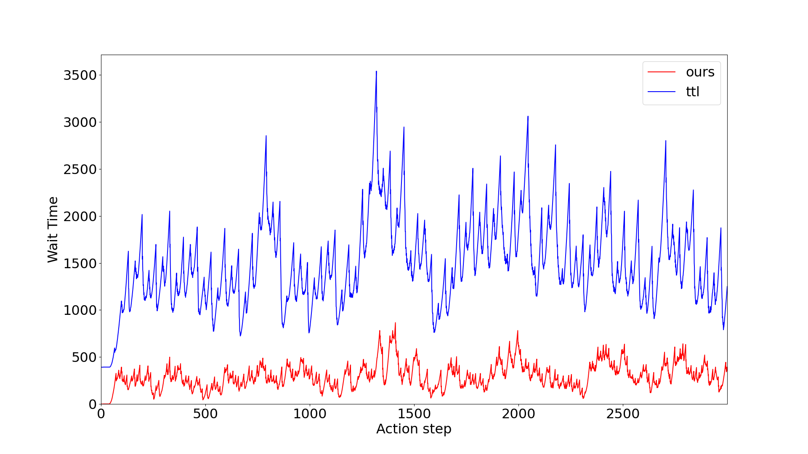
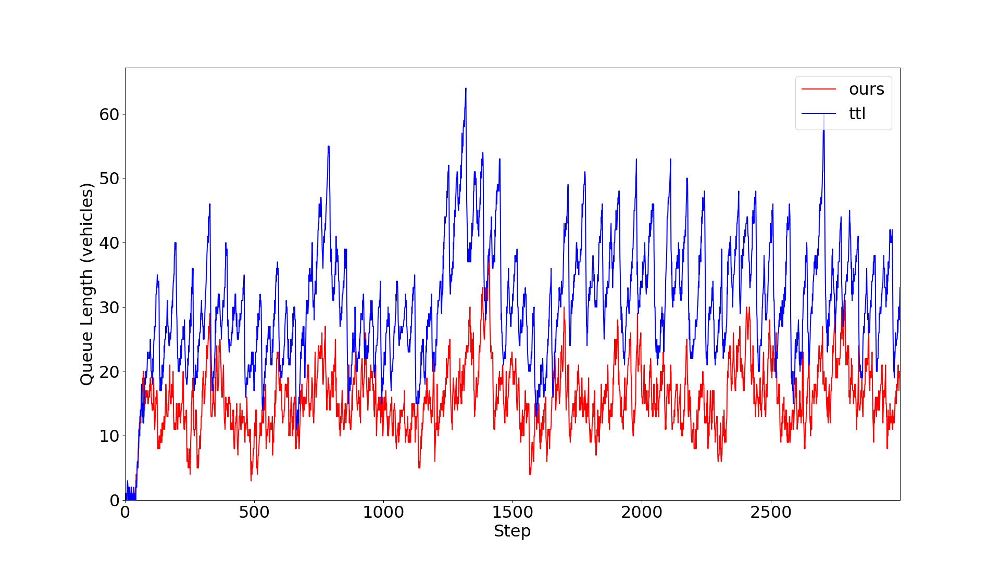
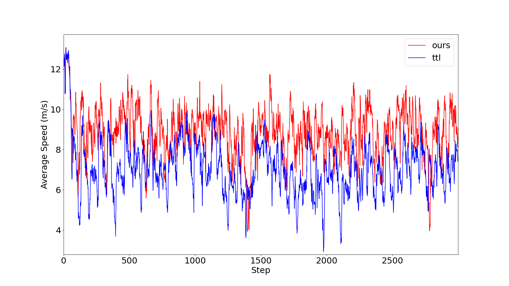

## Smart Traffic Engagement and Management System (STEMS)

### Traditional Traffic Lights (TTL)
https://user-images.githubusercontent.com/77334373/230962388-fc437332-2d74-4190-a3ec-d79e2924b994.mp4   

### STEMS
https://user-images.githubusercontent.com/77334373/230962622-1507083c-b94a-4f9e-be7a-054b072c37d1.mp4

### Plots

#### Waiting Time Comparison

    

#### Queue Length Comparison

    

#### Average Speed Comparison

    

### Environment
* A 4x4 intersection with left-hand driving rule
* Each arm is 500 meters long
* Right-most lane dedicated to right-turn only
* Left-most lane dedicated to left turn and straight
* Two middle lanes dedicated to only going straight

### Traffic Generation
* `SUMO_HOME/tools/random_trips.py` is used to generate vehicle trips
* The insertion times follow headway pattern of the [Poisson distribution](https://sumo.dlr.de/docs/Tools/Trip.html#insertion_distribution)

### The Double Deep Q-Learning Agent

#### State
* The current signal phase (one-hot encoded)
* Queue lengths per lane
* Total number of vehicles per lane
* Cumulative waiting time per lane

#### Reward
Change in cumulative waiting time of all vechicles between actions

#### Action
Choice of the traffic light phase from the 4 possible phases, described below. Every phase has a duration of 10 seconds. When the phase changes, a yellow phase of 3 seconds is activated
* North-South Advance: green for lanes in the north and south arm dedicated to turning left or going straight
* North-South Right Advance: green for lanes in the north and south arm dedicated to turning right
* East-West Advance: green for lanes in the east and west arm dedicated to turning left or going straight
* East-West Right Advance: green for lanes in the east and west arm dedicated to turning right

### Credits

AndreaVidali - [Deep Q-Learning Agent for Traffic Signal Control](https://github.com/AndreaVidali/Deep-QLearning-Agent-for-Traffic-Signal-Control)
