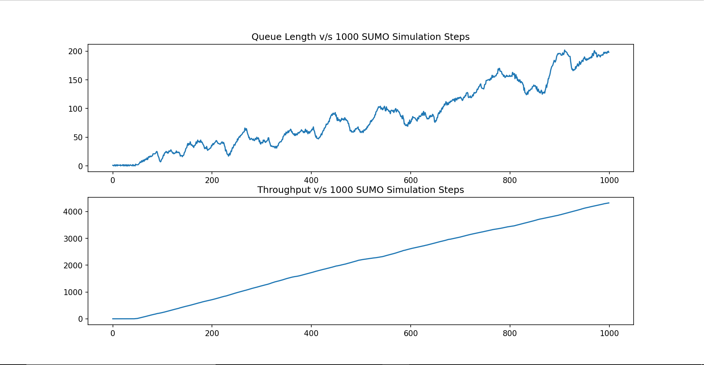

# STEMS
STEMS (Smart Traffic Engagement and Management System) is aimed towards optimizing traffic flow at intersections with the help of Reinforcement Learning

### Traditional Traffic Light (TTL)

